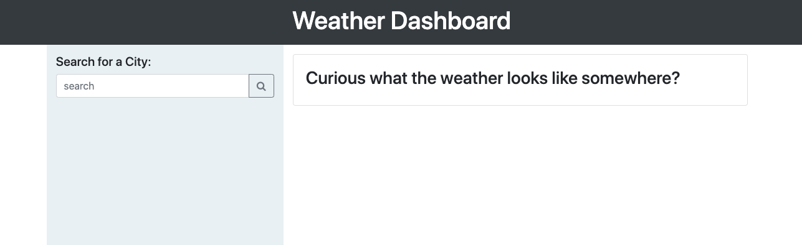
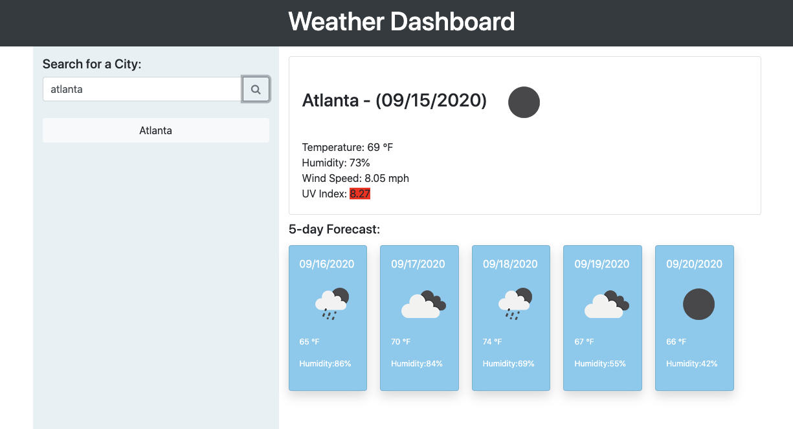
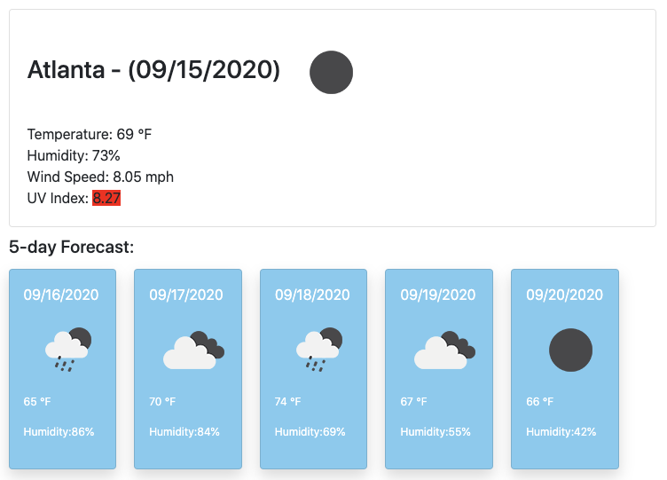
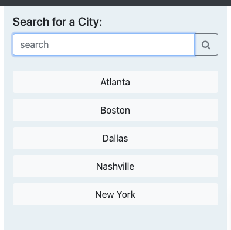

# City Search Weather Dashboard

This weather dashboard allows to user to search multiple cities and to learn the current and upcoming 5 day forecast to aid with travel planning.

[Weather Dashboard](https://raleighc.github.io/homework_06-weather_dashboard/)

## Usage
This weather dashboard gives the user a chance to search the forecast for multiple cities when planning travel.

The user will enter in one city name at a time to find the desired information.

Upon searching for a city, the user is presented with two rows of information. First, the information for that cities weather is populated, and second, the upcoming five day forecast is laid out in five panels.

As the user continues to search for new cities, the area under the search input is populated with recent searches. Each of these search results function as a button to recall the previous information.  This information is stored in local storage so that it will remain after refreshing the page.

## Creating This Page

For this project, I was provided with an image and demo of the working weather dashboard site. I then created the html, css and javascript files to generate the page and populate it with data from the weather API.
The main challenge for this project was the order of operation of each component on the page. When to call what information and in what order it needed to populate and trigger each bit of information on the page. I was only able to accomplish this by crating functions to house all of the on click information and then recalling that function multiple times throughout the pages operation.
Another significant challenge for me was running multiple API calls on the same page. Each bit of information needed had to run back to back without any intersecting information. I was able to simplify this process slightly by hard-coding and significant skeletal structure to apply the API information to.

## Contributions

When contributing to this repository, please contact the owner of the repository before pushing any updates.
When contributions are accepted, please update the readme.md noting any changes that have been made.

## Authors and Acknowledgment

The HTML and CSS files for this project were created and supplied by Georgia Tech Coding Boot Camp.

* [Open Weather Map API](https://openweathermap.org/)
* [Bootstrap](https://getbootstrap.com/)
* [w3schools!](https://www.w3schools.com/bootstrap4/default.asp)
* [Moment.js](https://momentjs.com/)

Thank you to all of my GT Bootcamp classmates who have offered advice and helped fix bugs alone the way.

Special thanks to my tutor Simon Rennocks for helping me understand local storage and sequencing the page with functions and callbacks..

## License

MIT License

Copyright (c) 2020 Raleigh Chesney

Permission is hereby granted, free of charge, to any person obtaining a copy
of this software and associated documentation files (the "Software"), to deal
in the Software without restriction, including without limitation the rights
to use, copy, modify, merge, publish, distribute, sublicense, and/or sell
copies of the Software, and to permit persons to whom the Software is
furnished to do so, subject to the following conditions:

The above copyright notice and this permission notice shall be included in all
copies or substantial portions of the Software.

THE SOFTWARE IS PROVIDED "AS IS", WITHOUT WARRANTY OF ANY KIND, EXPRESS OR
IMPLIED, INCLUDING BUT NOT LIMITED TO THE WARRANTIES OF MERCHANTABILITY,
FITNESS FOR A PARTICULAR PURPOSE AND NONINFRINGEMENT. IN NO EVENT SHALL THE
AUTHORS OR COPYRIGHT HOLDERS BE LIABLE FOR ANY CLAIM, DAMAGES OR OTHER
LIABILITY, WHETHER IN AN ACTION OF CONTRACT, TORT OR OTHERWISE, ARISING FROM,
OUT OF OR IN CONNECTION WITH THE SOFTWARE OR THE USE OR OTHER DEALINGS IN THE
SOFTWARE.

